# Top 25 Supplement Brands Ranked in 2025 (Latest Compilation)

In a world flooded with **supplements**, choosing the right ones can feel overwhelming. Whether you’re aiming to boost daily **health** or elevate athletic performance, you need trusted brands that deliver real results. We’ve compiled the top 25 supplement brands of 2025 – covering everything from advanced nutrition tech to old-school vitamin staples – so you can find quality **nutrition** without the guesswork. Each of these brands earns its spot by excelling in product purity, effectiveness, and catering to specific wellness goals.

## [Performance Lab](https://www.performancelab.com)
*Cutting-edge clean supplements for peak performance.*

 *Performance Lab’s ultramodern supplement lineup raises the bar for purity and efficacy.* This brand engineers some of the most advanced **nutritional supplements** on the market, emphasizing **clean labels** and evidence-based formulas. Their range spans daily essentials (like multis and omega-3s) to specialized enhancers (nootropic brain boosters, pre-workout, sleep aids). Every product is vegan-friendly and free of additives, so health enthusiasts and athletes alike trust the quality. **Why it’s #1:** Performance Lab’s obsessive focus on research-backed ingredients and third-party testing means you get *effective results without junk fillers* – ideal for anyone seeking safe, high-performance nutrition.

## [Onnit](https://www.onnit.com)
*Total Human Optimization.*

Onnit is a holistic wellness powerhouse famous for infusing **fitness** culture with cutting-edge science. It offers everything from *nootropic* brain supplements (hello, Alpha BRAIN®) to protein powders and functional foods. Founded on the idea of optimizing mind and body together, Onnit’s line caters to gym-goers, biohackers, and everyday folks chasing peak performance. Their products often feature earth-grown ingredients and unique blends (e.g. Shroom Tech® SPORT for endurance). Despite the serious science, Onnit keeps it fun and relatable – think **workout supplements**, **nutritional** kits, and even unconventional fitness gear. If you’re looking to level up mentally and physically with one brand, Onnit’s got you covered with *quality products trusted by pro athletes and weekend warriors alike*.

## [Thorne](https://www.thorne.com)
*Clinical-grade health supplements for all-round wellness.*

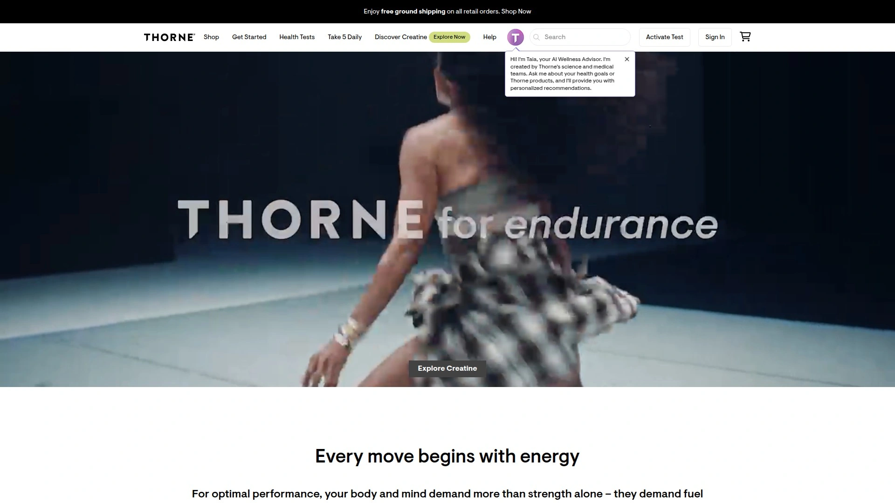

Thorne is revered for its **medical-grade** supplement quality and rigorous purity standards. This brand is a top choice of healthcare practitioners and pro sports teams, thanks to NSF-certified facilities and extensive testing. **Key offerings:** high-potency vitamins, research-backed herbal formulas, and even at-home health tests to personalize your regimen. Thorne’s products are formulated using the latest clinical research – from advanced multivitamins to targeted solutions for gut health, sports performance, and healthy aging. They’re perfect for discerning individuals who want *pharmaceutical-level quality* in their daily supplements. With Thorne, you know you’re getting science-backed efficacy and safety in every capsule.

## [Garden of Life](https://www.gardenoflife.com)
*Certified organic, whole-food-based nutrition.*

For those who value **organic** and non-GMO ingredients, Garden of Life is a standout. This brand turns real fruits, vegetables, and herbs into potent supplements – think probiotic blends, raw herbal formulas, and food-based vitamins. Their product lines (like Vitamin Code and mykind Organics) are co-created with health advocates such as Alicia Silverstone, emphasizing traceable sourcing and minimal processing. Garden of Life covers needs from prenatal health to **sports nutrition** with its Sport Certified proteins and plant-based products. Users love that the supplements are gentle on digestion and free of artificial junk. In short, it’s *farm-to-pill nutrition* that appeals to eco-conscious consumers and anyone seeking a more natural approach to supplementation.

## [Life Extension](https://www.lifeextension.com)
*Research-driven longevity and wellness support.*

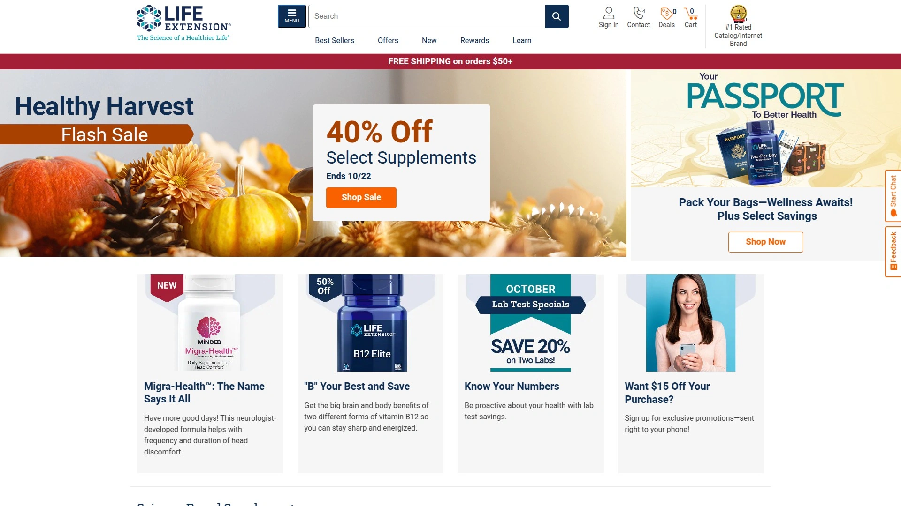

Life Extension has spent decades at the forefront of anti-aging and **longevity** supplements. They offer an extensive catalog – from high-potency omega-3 fish oils to innovative compounds like NAD+ boosters – all grounded in scientific research. If you’re looking to stay **healthy** and vibrant longer, Life Extension provides evidence-based formulas targeting heart health, cognitive function, immune support, and more. They even publish an acclaimed health magazine and fund research trials, underscoring their commitment to science. Customers appreciate features like transparent labels and purity certificates. With Life Extension, you get an almost apothecary-like selection of remedies and preventative supplements to help you *feel younger and live better for years to come*.

## [GNC](https://www.gnc.com)
*Global supplement superstore with something for everyone.*

GNC (General Nutrition Centers) is the household name in supplement retail, boasting thousands of stores worldwide and a massive online presence. It’s the one-stop shop for **vitamins**, protein powders, sports drinks, herbal remedies – you name it. GNC carries popular third-party brands alongside its own product lines (like Mega Men® multivitamins and Beyond Raw® sports supplements). This breadth makes it ideal for shoppers who want variety and the convenience of picking up everything in one haul. New to supplements? Knowledgeable staff and detailed online reviews help guide you. From bodybuilders hunting the latest pre-workout to seniors looking for joint support, GNC’s extensive selection and frequent promotions make it *easy to find the right product at any stage of your wellness journey*.

## [Bodybuilding.com](https://www.bodybuilding.com)
*The online hub for fitness supplements and advice.*

Known originally for its bodybuilding forums, this site has grown into a **huge online store** for sports nutrition. Bodybuilding.com offers a vast array of protein powders, muscle gainers, fat burners, and recovery supplements from top fitness brands. They also produce informative content – workout plans, supplement guides, and community reviews – making it easier to choose what fits your goals. Whether you’re a competitive bodybuilder or just hitting the gym to stay in shape, you’ll appreciate features like bundle deals and the loyalty program for savings. Plus, their in-house brand (Bodybuilding.com Series) provides quality basics like whey protein at budget-friendly prices. It’s more than a store; it’s *an online community* that supports your fitness journey with both products and knowledge.

## [iHerb](https://www.iherb.com)
*Global e-store for natural supplements and wellness goodies.*

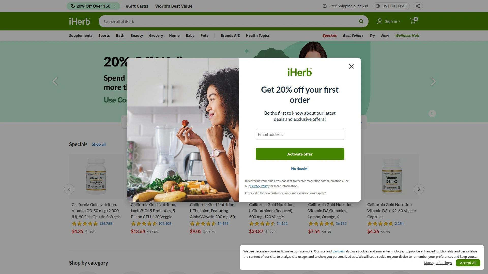

iHerb has gained a cult following as the go-to online marketplace for health products, especially if you’re outside the U.S. With worldwide shipping and a site translated into multiple languages, iHerb makes it simple to get American and global **supplement** brands delivered to your door. Their catalog is massive: **vitamins**, herbal extracts, K-beauty items, sports nutrition, even healthy groceries. The prices are often discounted and user reviews abound, so you can shop confidently. Importantly, iHerb prioritizes product authenticity (direct supply) and packs orders carefully for long trips. From Nature’s Way echinacea to the latest collagen powder trending on TikTok, iHerb likely has it. It’s a *paradise for deal-hunters and international wellness enthusiasts* seeking variety and value.

## [Vitamin Shoppe](https://www.vitaminshoppe.com)
*Trusted brick-and-mortar and online vitamin retailer.*

The Vitamin Shoppe is another major destination for all things nutrition, with over 700 stores across the US and a robust online site. It specializes in **vitamins**, supplements, and natural health products, offering both big brands and its own cost-effective house brand (“The Vitamin Shoppe” and “plnt” for herbals). Customers appreciate the knowledgeable in-store staff (they call them “Health Enthusiasts”) and services like free nutrition coaching. Whether you need a specific high-quality probiotic or just a basic vitamin D, chances are they have multiple options on the shelf. They also run a rewards program and subscription savings for repeat buyers. It’s a reliable, no-frills retailer that shines for its *wide selection and in-person guidance*, making healthy living accessible to many.

## [NOW Foods](https://www.nowfoods.com)
*Natural values, vast selection, and affordability.*

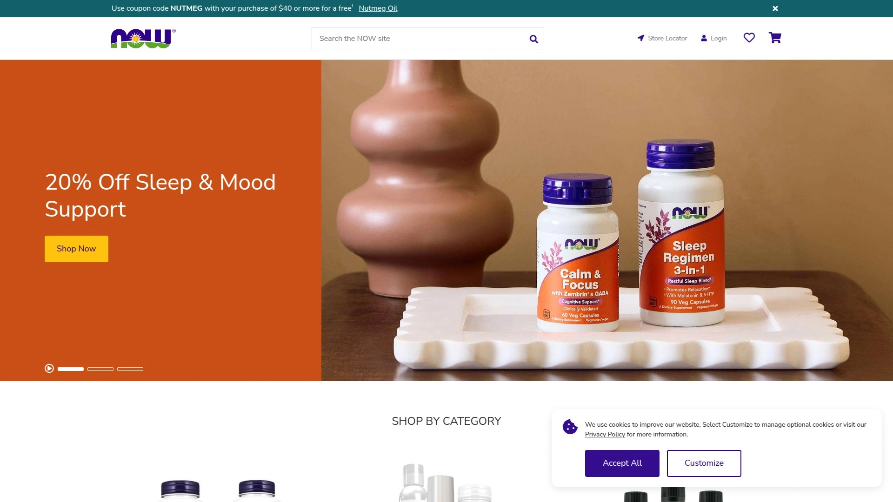

NOW Foods is a family-owned brand that has become synonymous with quality *and* affordability in the supplement world. With a range of 1,400+ products, it covers everything from standard vitamins and minerals to sports nutrition, essential oils, and organic foods. NOW is known for its rigorous in-house testing and commitment to natural ingredients – many of their supplements are non-GMO, vegetarian, and free of common allergens. Despite this quality, they keep prices wallet-friendly, appealing to budget-conscious consumers who refuse to compromise on health. Whether you’re grabbing a bottle of vitamin C, whey protein for your workouts, or even healthy pantry staples like almond flour, NOW likely produces it. It’s a **trusted** staple brand that proves you can get *safe, effective supplements without breaking the bank*.

## [Nature Made](https://www.naturemade.com)
*America’s favorite pharmacist-recommended vitamins.*

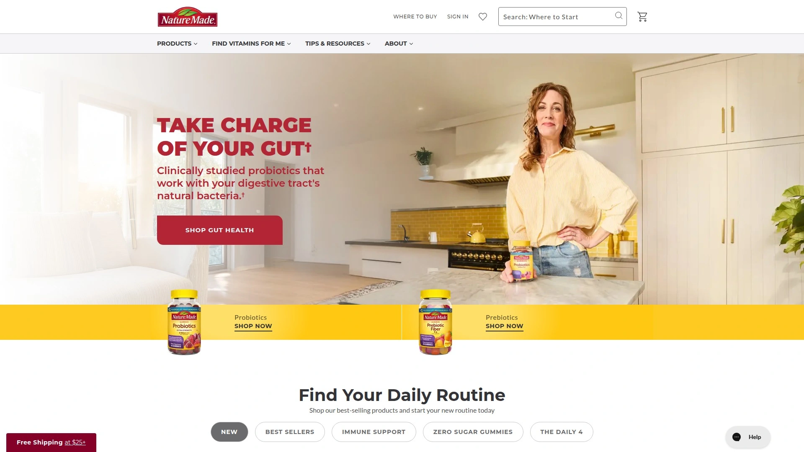

If you’ve ever strolled the supplement aisle of a drugstore, you’ve seen Nature Made’s bright yellow labels. This mainstream brand has earned the #1 Pharmacist Recommended seal in many categories by delivering dependable, science-verified products for decades. Nature Made focuses on core health needs – think multivitamins, single letter vitamins (A, B, C, D, E), and condition-specific formulations (like Stress B-Complex or prenatal vitamins). They invest in quality with USP verification on many products, assuring purity and potency. The approach is no-nonsense and evidence-based, which appeals to doctors and everyday users alike. For consumers starting their wellness journey, Nature Made offers a comforting familiarity and proven track record. It’s an **accessible brand** that provides *simple, effective supplements you can trust at any pharmacy near you*.

## [Transparent Labs](https://www.transparentlabs.com)
*All-natural sports supplements with no secrets.*

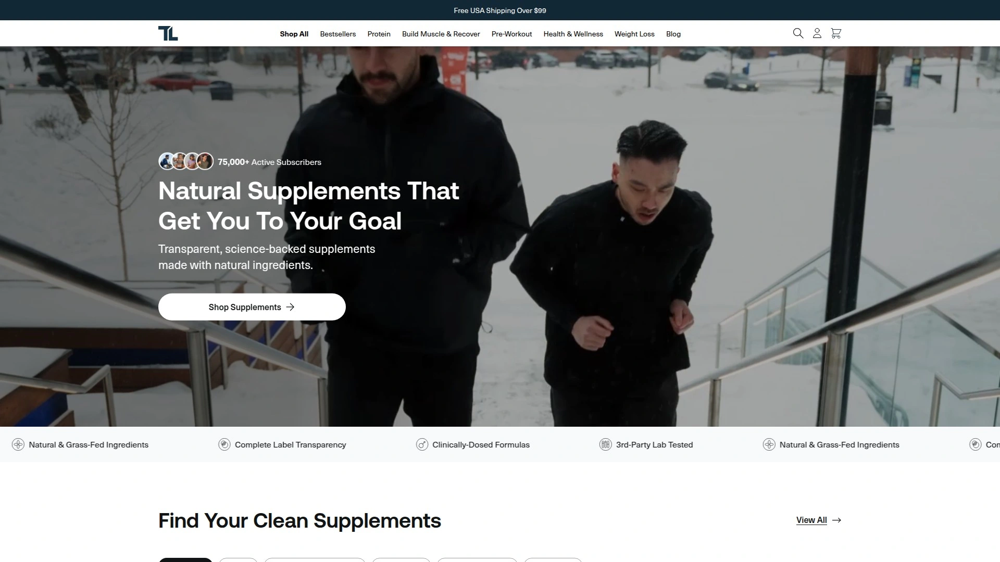

Tired of proprietary blends and mystery ingredients in your pre-workout? Transparent Labs was created to change that. As the name implies, this brand practices full disclosure of ingredients and dosages, using only natural sweeteners and colors. Fitness enthusiasts love their potent pre-workouts, fat burners, and protein powders that *actually list every ingredient’s amount*. No artificial junk means less bloating and jittery side effects, too. Transparent Labs formulates products based on up-to-date research, targeting goals like muscle gain, endurance, or recovery. For example, their BULK pre-workout includes clinical doses of citrulline and beta-alanine, openly labeled. While priced slightly premium, you’re paying for purity and efficacy. If clean fuel for your workouts is a priority, this **brand** ensures you *know exactly what you’re putting in your body for maximum results*.

## [Legion Athletics](https://www.legionathletics.com)
*Naturally sweetened, evidence-based fitness supplements.*

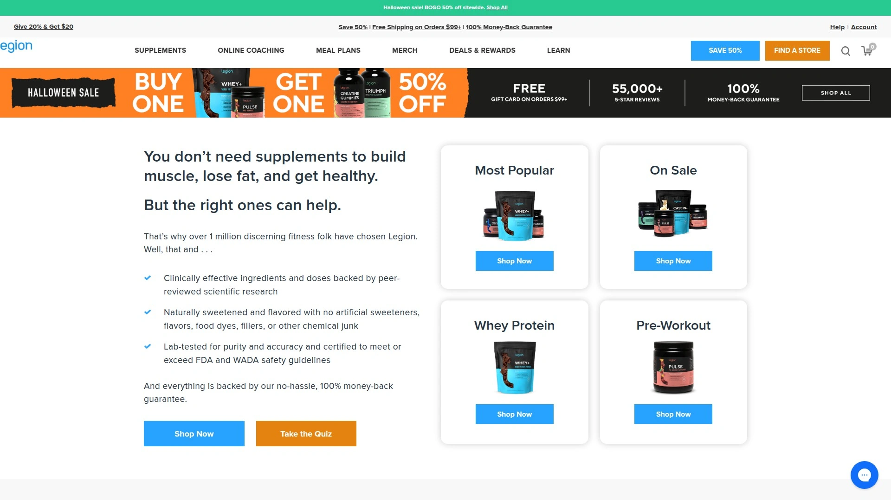

Legion has rapidly risen to prominence among gym-goers by championing science and clean ingredients. Founded by fitness author Mike Matthews, Legion’s formulas avoid artificial sweeteners and fillers, opting for natural alternatives like stevia. More importantly, every product is formulated with doses backed by published studies (and they cite the research). The lineup covers **sports nutrition** staples: whey and plant proteins, pre-workouts (the popular Pulse), post-workout recovery, fat loss aids, and more. They even offer a 100% money-back guarantee if you don’t love the results – a nod to their confidence in effectiveness. Legion’s transparent approach and personable brand voice (they’re not shy about busting fitness myths) resonate with a new generation of lifters. It’s an excellent choice for anyone seeking *clean, hardcore supplements that don’t rely on marketing hype but actual results*.

## [BulkSupplements](https://www.bulksupplements.com)
*Pure bulk ingredients for DIY supplementers.*

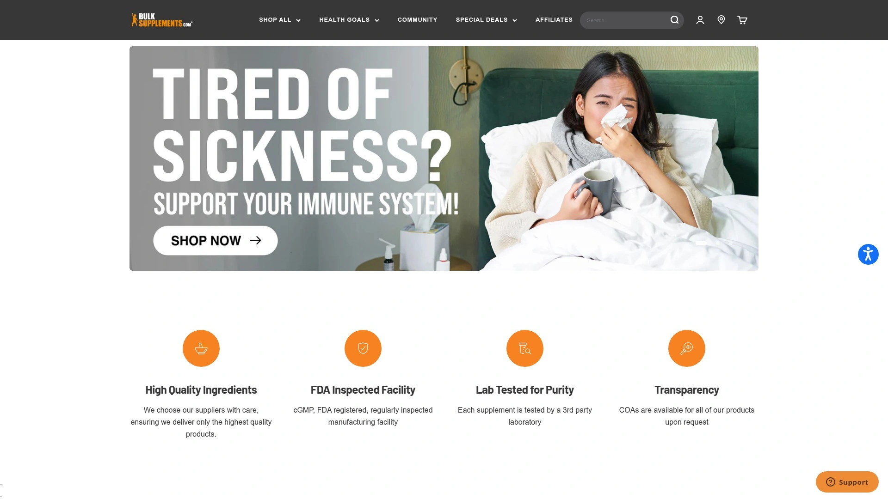

For the no-frills, **DIY** supplement crowd, BulkSupplements is a goldmine. This online brand supplies over 500 pure nutritional ingredients – from creatine monohydrate to ashwagandha powder – typically in minimalist foil bags. You won’t get fancy flavors or pretty packaging here, but you will get high-quality powders and capsules in whatever quantity you need (often at wholesale prices). It’s perfect if you like to mix your own pre-workout, fill your own capsules, or just save money by buying basics in bulk. Despite the low costs, BulkSupplements maintains third-party lab testing on their products for purity. They’re a favorite among bodybuilders, hobby chemists, and anyone who finds joy in customizing their supplement stack. In short, this company lets you *skip the middleman and branding costs* to focus on the raw nutrients – simple, cheap, and effective.

## [Sports Research](https://www.sportsresearch.com)
*Innovative wellness essentials for active lifestyles.*

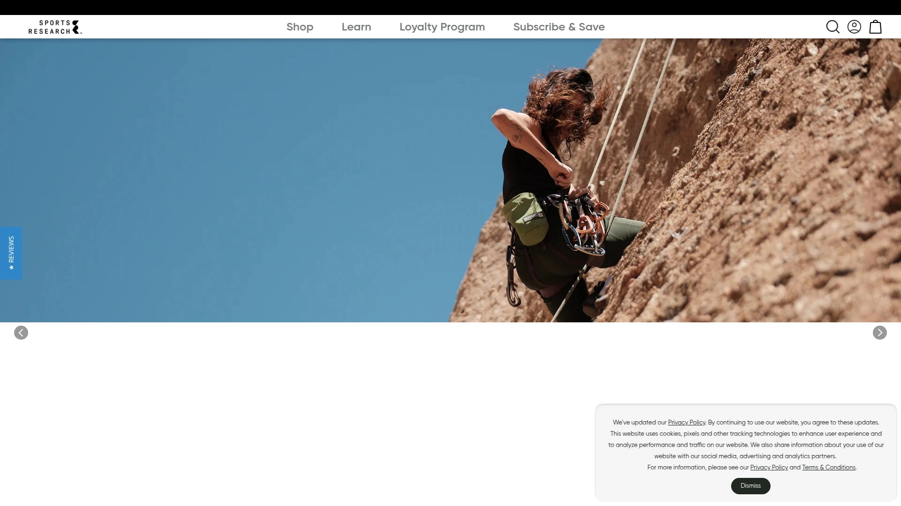

Sports Research might sound like a hardcore name, but it’s a brand with broad appeal in the health and fitness arena. Family-run since 1980, they offer specialty products that often become trends in their own right – think **Sweet Sweat** workout enhancer gel, collagen peptides for skin and joint health, and MCT oil for keto fans. They also have vitamins and supplements geared toward active folks (turmeric curcumin, omega-3 fish oil, etc.), all with an emphasis on quality sourcing. Sports Research tends to innovate within niches: for example, they popularized waist-trimmer belts alongside their topical workout gel, and their collagen powder consistently ranks high for purity. The brand’s focus on both *performance and wellness* makes it popular with fitness enthusiasts who also care about overall health. If you’re looking for unique tools and supplements to support your exercise routine and recovery, Sports Research likely has something up its sleeve.

## [Pure Encapsulations](https://www.pureencapsulations.com)
*Hypoallergenic, professional-grade supplements.*

Pure Encapsulations is the brand doctors and nutritionists often turn to for patients with sensitive systems. Why? Every supplement in their line is free from common allergens (no gluten, nuts, artificial additives) and is produced to pharmaceutical-grade standards. Their catalog covers a therapeutic range – from standard vitamins to very specialized formulations (methylated B-complex, antioxidant blends, etc.). You won’t see flashy marketing here; Pure’s reputation is built on trust in clinical settings. Many products are even NSF Certified for Sport, underscoring the purity needed for professional athletes. While you typically find Pure Encapsulations through licensed healthcare providers or select retailers, anyone can appreciate their commitment to *simple, “pure” ingredient lists and top-tier quality control*. It’s a go-to for those who need ultra-clean supplements due to allergies, or simply want **the best of the best** for their health regimen.

## [Seed](https://www.seed.com)
*Precision probiotic science for gut health.*

Gut health is having a moment, and Seed is leading the charge with its DS-01® Daily Synbiotic. This is not your grocery store probiotic – Seed’s flagship is a highly concentrated formula of 24 clinically-studied probiotic strains with a prebiotic capsule, engineered to survive digestion and deliver benefits right where you need them. The company positions itself as much an education platform as a **supplement** seller, sharing science insights about the microbiome. Their monthly subscription model and chic green packaging have made taking probiotics surprisingly cool. **Ideal for:** people serious about improving digestion, skin health, or even mood through the gut-brain axis. While Seed’s product line is currently focused (quality over quantity), the depth of research and efficacy put into that one product makes it *worth the hype for those seeking top-of-the-line gut support*.

## [Ritual](https://www.ritual.com)
*Transparent daily vitamins with traceable ingredients.*

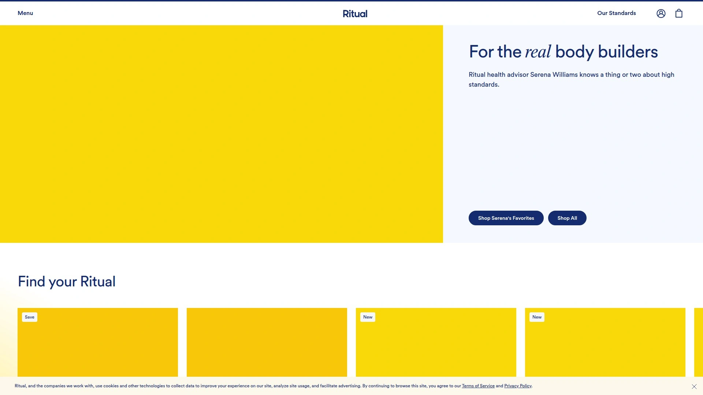

Ritual reimagined the daily multivitamin, especially for women, by emphasizing what’s *not* in it as much as what is. These capsules are vegan, non-GMO, free of artificial colorants or fillers, and even have a novel delayed-release design (so you can take them on an empty stomach without nausea). Each ingredient and its sourcing are openly disclosed – you can trace their omega-3 oil to the Alaska fishery or their methylated B12 to a specific lab. Ritual started with a women’s essential multivitamin and expanded to men, teens, prenatal, and more, all following the same clean ethos. They offer a subscription service to conveniently refill your supply each month. With minimalist packaging and a mint tab in every bottle for freshness, Ritual feels modern and premium. It’s perfect for those who want a **daily vitamin** that covers nutritional gaps with *transparency and style*, minus any unnecessary extras.

## [Rootine](https://www.rootine.co)
*Personalized nutrient packs based on your unique profile.*

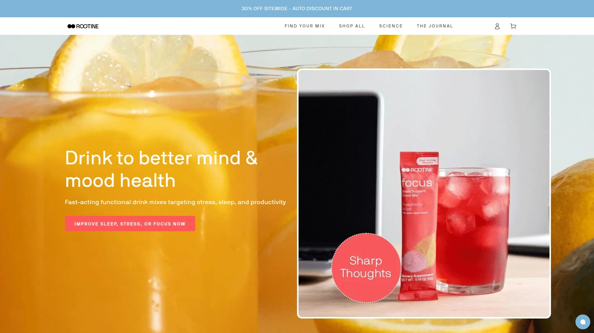

Rootine takes vitamin customization to the next level. Instead of a one-size-fits-all pill, Rootine creates a formula just for you – factoring in data from a lifestyle quiz, and optionally your DNA test results and even blood nutrient levels. The outcome is delivered as microbeads in convenient daily sachets, each packed with the precise vitamins and minerals you need (nothing more, nothing less). It’s **personalized nutrition** made simple: tear open a packet and down the beads (they can be mixed into food or smoothies too). This approach suits health hackers and busy professionals alike who want to optimize their nutrition without juggling 10 different supplement bottles. While it requires an upfront investment of time (and money) to get your custom inputs analyzed, the payoff is a truly tailored regimen. If you’ve ever wondered what *targeted supplementation* could do for your energy, focus, or overall wellness, Rootine offers a forward-thinking glimpse into that future.

## [Persona Nutrition](https://www.personanutrition.com)
*Customized vitamin packs with expert guidance.*

Persona Nutrition delivers a personalized **vitamin subscription** that feels like having a nutritionist on call. After you complete a thorough online assessment about your health goals, diet, and lifestyle, Persona recommends a curated selection of supplements just for you. Your monthly supply arrives as daily packs (morning and night splits if needed) with your name on them – a nice personal touch. What sets Persona apart is the depth of its catalog (they have a huge range of supplements to pull from, including specialty herbs and condition-specific formulas) and the access to nutritionists for consultation. Backed by Nestlé Health Science, Persona emphasizes evidence-based recommendations and even checks for interactions if you report medications. It’s a convenient solution if you want expert-tailored supplements without visiting a clinic. Essentially, Persona takes the guesswork out of what to take and when, providing *daily vitamin packs aligned to your unique needs*, delivered to your doorstep.

## [HUM Nutrition](https://www.humnutrition.com)
*Beauty meets wellness: vitamins for skin, body & mood.*

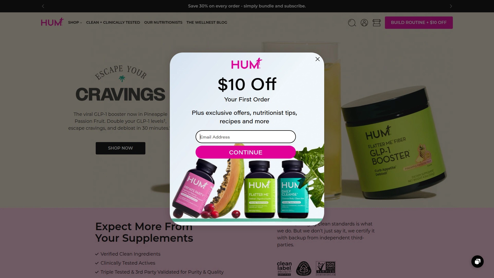

HUM Nutrition targets the millennial and Gen Z set with its fun, beauty-centric approach to supplements. Each product has a catchy name and a specific concern it addresses – “Glow Sweet Glow” gummies for skin hydration, “Red Carpet” for hair and skin shine, or “Mood Juice” adaptogen powder for stress support. Don’t let the cute packaging fool you; HUM’s formulas are developed with registered dietitians and based on clinical research for their ingredients. They focus on clean, potent actives (non-GMO, gluten-free, often vegan) and most supplements are in easy forms like softgels or gummies. HUM also offers a personal quiz to get product recommendations tailored to your beauty and wellness goals. It’s an engaging brand for those who want to **boost their appearance and well-being** simultaneously – think of it as *skincare from within*, along with energy and mood perks. With HUM, taking your daily vitamins feels a bit more like a self-care ritual than a chore.

## [BioOptimizers](https://www.biooptimizers.com)
*Biohacker-grade supplements for digestion and performance.*

BioOptimizers caters to those who treat **health optimization** almost like a science experiment (in the best way possible). They specialize in niche but critical areas: high-potency digestive enzymes (MassZymes), broad-spectrum probiotics (P3-OM), and mineral supplements like Magnesium Breakthrough that contains multiple magnesium forms for better absorption. The founders are biohackers and athletes who formulate these products to solve specific problems (e.g., bloating, poor sleep, slow muscle recovery) that mainstream supplements might not fully address. Many users report noticeably improved digestion, metabolism, or sleep quality after integrating BioOptimizers into their routine. While the products come at a premium price, the targeted efficacy can be worth it if you’re chasing peak performance or relief from stubborn issues. With detailed educational materials and strong doses, BioOptimizers speaks to the *experimenters and high-achievers* looking for an extra edge in their supplement strategy.

## [Athletic Greens](https://www.athleticgreens.com)
*All-in-one superfood powder for daily nutrition.*

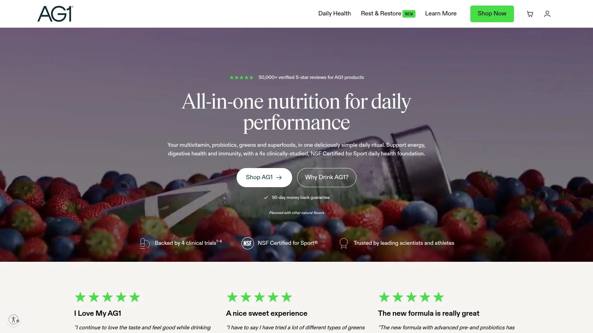

Athletic Greens (AG1) isn’t just a **supplement**, it’s marketed as a daily ritual. One scoop of this verdant powder mixed in water gives you a cocktail of 75 ingredients – from vitamins and minerals to probiotics, greens, adaptogens, and more. It’s essentially nutritional insurance for those days when your diet isn’t perfect (let’s be honest, that’s most days for many of us). Athletes love it for the comprehensive coverage, travelers rely on it for convenience, and busy professionals appreciate not having to pop multiple pills. The taste is surprisingly palatable for a greens powder, and it’s easy on the stomach. Athletic Greens has gained a loyal following through word-of-mouth and endorsements, often by podcasters and health gurus who swear by its energy and immune support benefits. If you want a *one-and-done solution* each morning to cover your bases, AG1 is the reigning champion of all-in-one blends.

## [Huel](https://www.huel.com)
*Complete meal nutrition in a shake or bar.*

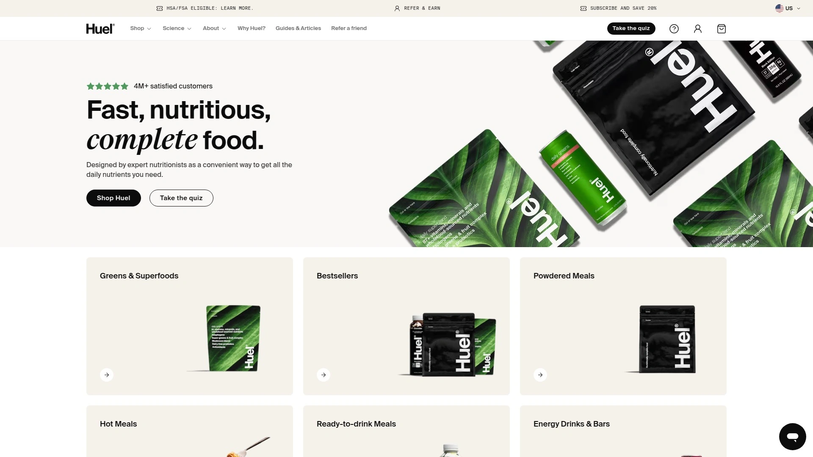

Huel (short for “Human Fuel”) approaches nutrition from a food angle rather than pills and capsules. It offers **meal replacement** powders, ready-to-drink shakes, and bars that contain a balance of protein, carbs, fats, fiber, and 27 essential vitamins and minerals – everything your body needs from a meal. Popular among techies, gamers, and anyone too busy to cook, Huel’s products are vegan and made from real food ingredients like oats, pea protein, flaxseed, and MCTs from coconut. You can customize flavors or stick to basics like Vanilla; either way, it’s convenient, filling, and surprisingly cost-effective per meal. Huel’s ethos is sustainability too: minimal waste, long shelf life, and a reduced food footprint. It’s not a traditional supplement brand, but it scratches the same itch for **efficient nutrition**. Use it to replace breakfast on a rushed morning or as a nutritious lunch at your desk – *Huel keeps you fueled with balanced, hassle-free meals* whenever you need them.

## [MyProtein](https://www.myprotein.com)
*Affordable performance nutrition for everyone.*

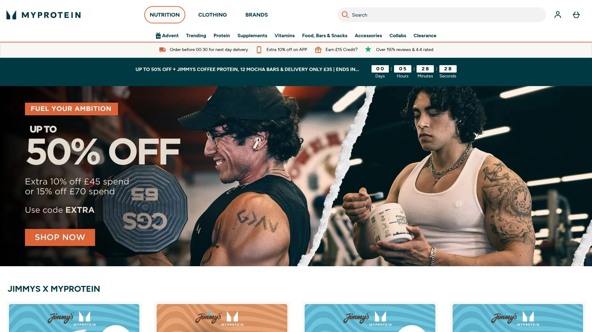
  

MyProtein has become one of Europe’s biggest **sports nutrition** brands by combining a huge product range with budget-friendly pricing. Gym enthusiasts on a budget flock to MyProtein for bulk whey protein (with a ton of flavor options), creatine, BCAAs, vitamins, and even fitness apparel. Despite the low prices, the quality is solid – their protein powders are tested for purity, and they frequently introduce innovative formulas (like Clear Whey Isolate, a fruity protein drink). MyProtein also caters to various diets with vegan protein lines and snack alternatives (think protein cookies and chips). They run constant discounts and seasonal sales, making it even easier to stock up. The brand’s global expansion means you can find localized websites and shipping almost anywhere. If you want reliable workout staples or healthy snacks without paying a premium for fancy branding, MyProtein delivers *no-nonsense quality and value*, helping rookies and pros alike power their goals.

---

### FAQ: Common Questions about Supplement Brands

**Q1: How do I choose the right supplement brand for my needs?**
**A1:** Start by identifying your health goals (e.g. muscle gain, improved immunity). Look for brands that specialize in those areas and check their ingredient quality and transparency. Reading user reviews and ensuring the brand tests for purity can also guide you towards a trustworthy choice.

**Q2: Are these supplement brands good for beginners?**
**A2:** Absolutely. Many of the top brands (like **Nature Made** or **Onnit**) offer clear guidance on usage. Beginners should stick to well-rounded basics (multivitamins, protein, etc.) from reputable brands and gradually add specialized supplements as needed.

**Q3: Do these companies offer vegan or allergen-free options?**
**A3:** Yes, several brands here cater to dietary restrictions. For example, **Performance Lab** and **Garden of Life** have vegan-certified products, and **Pure Encapsulations** avoids common allergens. Always check each brand’s product labels – most have filters on their websites for vegan, gluten-free, etc.

**Q4: How can I tell if a supplement is high quality?**
**A4:** High-quality supplements typically have transparent labels (no “proprietary blends”), are third-party tested for purity, and come from brands with good reputations. Certifications like USP, NSF for Sport, or organic seals are green flags. All the brands listed here are known for quality control, so they’re a solid starting point.

---

### Conclusion

Choosing the right supplements can dramatically simplify your wellness routine and amplify results. The **25 brands** above represent the best of the best in 2025 for quality, innovation, and trustworthiness. Whether you need the clinical-grade purity of **Thorne**, the personalized touch of Rootine or Persona, or the all-in-one convenience of Athletic Greens, there’s something here for every health goal and lifestyle. Remember, consistency is key – even the top supplements only work if you take them regularly. Our top pick, **Performance Lab**, stands out for its across-the-board excellence in clean, effective formulations, making it especially suitable for those who refuse to settle for anything less than the best in their wellness journey. Here’s to a healthier, more energized you!
